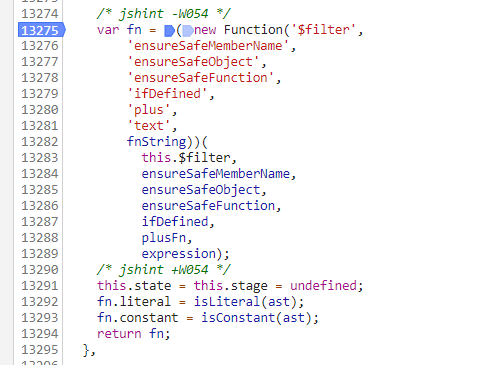
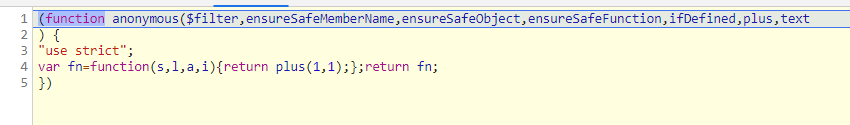
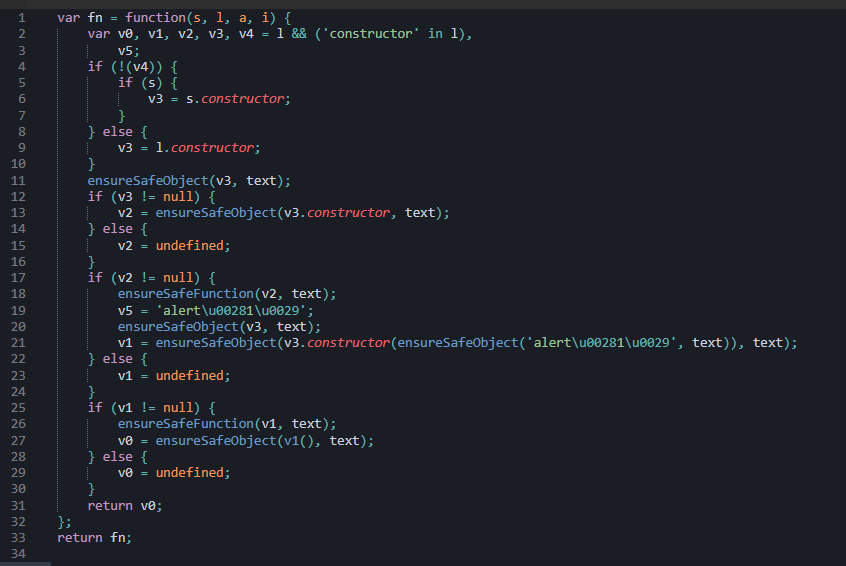

# AngularJS

(translated https://portswigger.net/research/xss-without-html-client-side-template-injection-with-angularjs)

---

## XSS angular via expression

## Angular expression

- AngularJS expressions can be written inside double braces: {{ expression }}.

- AngularJS expressions can also be written inside a directive: ng-bind="expression".

- 


## some note:
- Đối với `angular expression` đều thông qua `sandbox` để đảm bảo an toàn cho ứng dụng -> Đê thực thi được code JS cần vượt qua cơ chế này.

- Debug AngularJS with `chrome dev`:

  - Tạo file html 

  ```html
  <html>
  <head> 
  <meta charset="utf-8">
  <script src="https://ajax.googleapis.com/ajax/libs/angularjs/1.4.6/angular.js"></script>
  </head>
  <body>
  <div ng-app>{{1+1}}</div>
  </body>
  </html>		
  ```

  - Đặt break point trên file `angular.js` ở line `13275` để tiến hành xem code sanbox

  

  - Code sandbox:


    

  - Thử debug expression sau : `{{constructor.constructor('alert(1)')()}}` . Thu được code: 
  - Theo js : khi gọi đến contructor nó sẽ trả về function tạo nên class

  

  - Tất cả các object đều được check qua hàm [ensureSafeObject](https://github.com/angular/angular.js/blob/v1.4.6/src/ng/parse.js#L60-L85) : hàm này sẽ check  Function constructor, `windowsObject`, `Dom element`  , hoặc là `Object`
  - Ngoài ra còn một số hàm check : `ensureSafeMemberName` (check `__proto__`, ) , `ensureSafeFunction` (check cái method `CALL`,`BIND`,...)

## Escaping the sandbox

