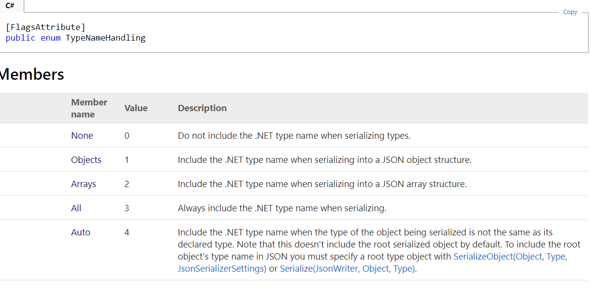
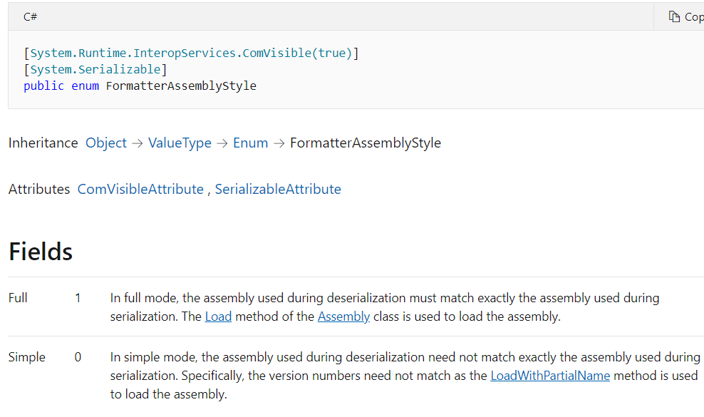
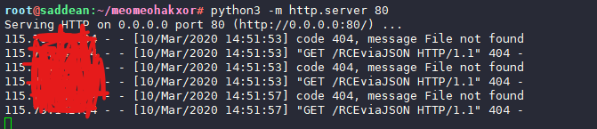
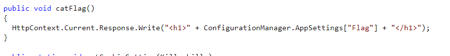
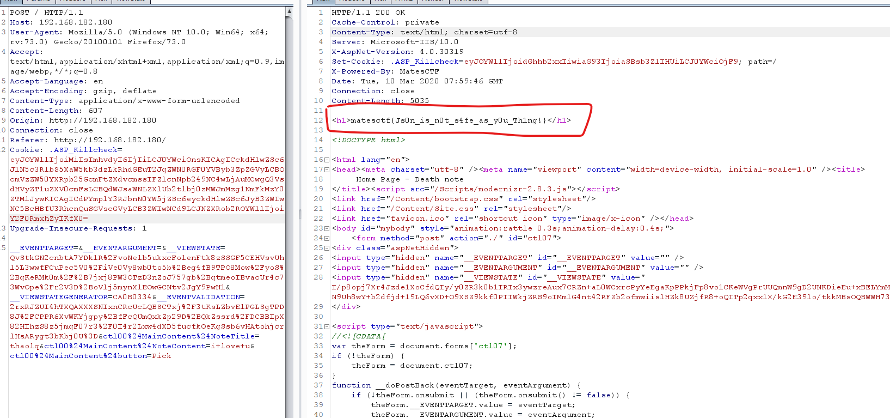
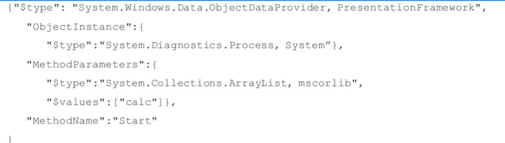
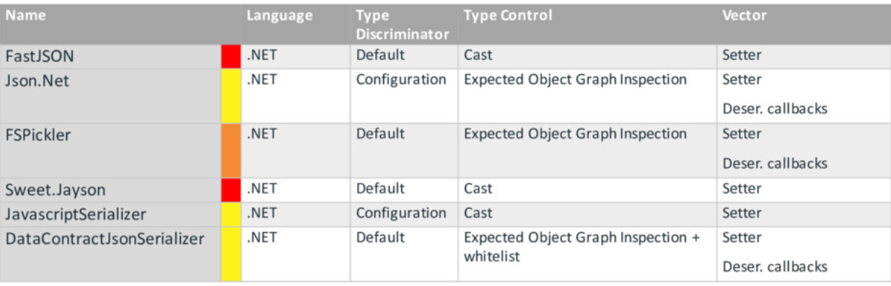

#  [Web] MatesCTF Season 3 – Round 2 – Simple death note (JSON deserialize)

---

source : [here](https://drive.google.com/drive/folders/1edBlHbXAFTtXjeImZQxFjqqitLaYLLvK?usp=drive_open)

---

# Play for fun ctf 

- Get dll from source : `/web04.dll.zip`

- Ppen with `dotpeak`

- Detect cookie start with `ey` -> base64decode -> `{"` --> json  . Trace code
- On `_default` (decocompile with dotpeak): JSON deserialize vulnerability


- Type setting serialize :

  - ``serializerSettings.set_TypeNameHandling((TypeNameHandling) 4);`` => Có thể sử dụng object của .NET 
  - https://www.newtonsoft.com/json/help/html/T_Newtonsoft_Json_TypeNameHandling.htm

  

  - `serializerSettings.set_TypeNameAssemblyFormat(FormatterAssemblyStyle.Simple);` => Không check asembly ????

  https://docs.microsoft.com/en-us/dotnet/api/system.runtime.serialization.formatters.formatterassemblystyle?redirectedfrom=MSDN&view=netframework-4.7.2

  

- Some paper for reading:
  - https://www.alphabot.com/security/blog/2017/net/How-to-configure-Json.NET-to-create-a-vulnerable-web-API.html
  - https://www.owasp.org/images/d/d7/Marshaller_Deserialization_Attacks.pdf.pdf
  - **Summary:**``TypeNameHandling``: The only kind that is not vulnerable is the default: `TypeNameHandling.None`
- Using ysoserialize.net gen payload with gadget `ObjectDataProvide`
- **SUCCESSFULL deserialize !!!!**



- **For solve ctf cat flag :** searching flag => web04.App_Start.Helper.catFlag()

  

- Using : ObjectDataProvider with instance call method catFlag()

```json
{"Name":"2","how":"2","tag":{
    '$type':'System.Windows.Data.ObjectDataProvider, PresentationFramework, Version=4.0.0.0, Culture=neutral, PublicKeyToken=31bf3856ad364e35',
    'ObjectInstance':{'$type':' web04.App_Start.Helper, web04'},"MethodName":"catFlag"
}}		
```



---

# Analysis gadget

- Some gadget:
  - ``System.Configuration.Install.AssemblyInstaller`` : "Execute payload on local assembly load"
  - ``System.Activities.Presentation.WorkflowDesigner`` : "Arbitrary XAML load"
  - ``System.Windows.ResourceDictionary`` : "Arbitrary XAML load"
  - ``System.Windows.Data.ObjectDataProvider`` : "Arbitrary Method Invocation"

- ``System.Windows.Data.ObjectDataProvider``: Chain: 



---

# Sumarry




## FastJSON

- Default , if deserialize json unstrusted

```c#
Var obj = (ExpectedType) JSON.ToObject(untrusted)	
```

- Invokes Setter

---

## JavaScriptSerializer

- **System.Web.Script.Serialization.JavaScriptSerializer**
- Default not vuln , can exploit it config wrong

```c#
JavaScriptSerializer sr = new JavaScriptSerializer(new SimpleTypeResolver());
string reqInfo = apiService.authenticateRequest();
reqDetails det = (reqDetails) (sr.Deserialize<reqDetails>(reqInfo))
```

(xem them ve resolve ???)

https://viblo.asia/p/su-dung-generics-trong-c-924lJDvNKPM

---

## DataContractJsonSerializer

- **System.Runtime.Serializeation.Json.DataContractJsonSerializer**
- performs a strict type graph inspection and whitelist creation

```c#
var typename = cookie['typename'] 	//can control 

var ser = new DataContractJsonSerializer(Type.GetType(typename))
var obj = ser.readObject(anything);
```

---

## Json.net

- `TypeNameHandling` config not `none`

```
[JsonProperty(TypeNameHandling=TYpeNameHandling.ALL)]
deserialize anything object's attacker inject => exploit it
(xem vi du ctf)
```

