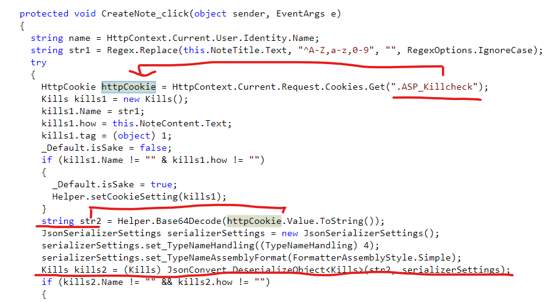
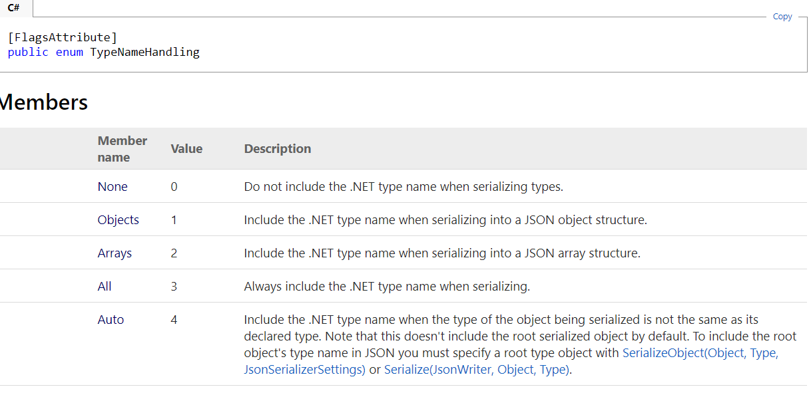
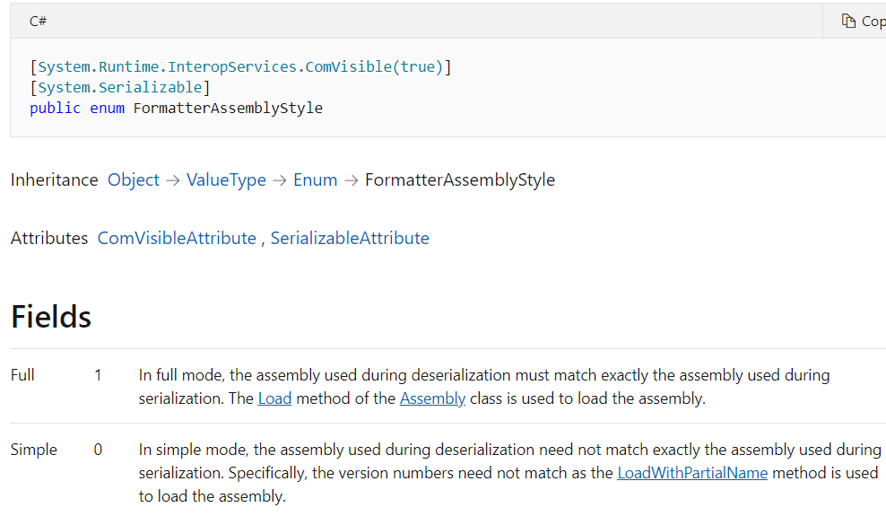
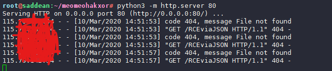
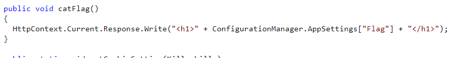
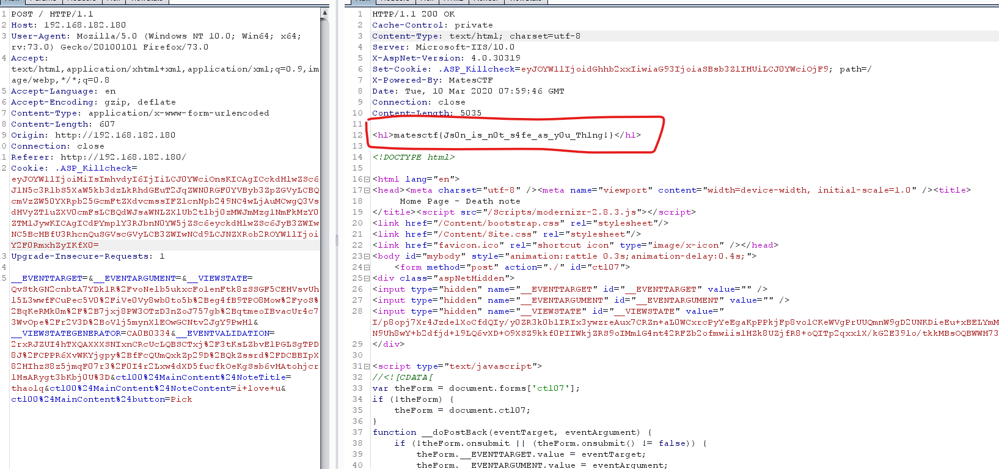

#  [Web] MatesCTF Season 3 – Round 2 – Simple death note (JSON deserialize)

---

source : [here](https://drive.google.com/drive/folders/1edBlHbXAFTtXjeImZQxFjqqitLaYLLvK?usp=drive_open)

---

# Play for fun ctf 

- Get dll from source : `/web04.dll.zip`

- Ppen with `dotpeak`

- Detect cookie start with `ey` -> base64decode -> `{"` --> json  . Trace code
- On `_default` (decocompile with dotpeak): JSON deserialize vulnerability

- Type setting serialize :

  - ``serializerSettings.set_TypeNameHandling((TypeNameHandling) 4);`` => Có thể sử dụng object của .NET 
  - https://www.newtonsoft.com/json/help/html/T_Newtonsoft_Json_TypeNameHandling.htm

  

  - `serializerSettings.set_TypeNameAssemblyFormat(FormatterAssemblyStyle.Simple);` => Không check asembly ????

  https://docs.microsoft.com/en-us/dotnet/api/system.runtime.serialization.formatters.formatterassemblystyle?redirectedfrom=MSDN&view=netframework-4.7.2

  

- Some paper for reading:
  - https://www.alphabot.com/security/blog/2017/net/How-to-configure-Json.NET-to-create-a-vulnerable-web-API.html
  - https://www.owasp.org/images/d/d7/Marshaller_Deserialization_Attacks.pdf.pdf
  - **Summary:**``TypeNameHandling``: The only kind that is not vulnerable is the default: `TypeNameHandling.None`
- Using ysoserialize.net gen payload with gadget `ObjectDataProvide`
- **SUCCESSFULL deserialize !!!!**

- **For solve ctf cat flag :** searching flag => web04.App_Start.Helper.catFlag()

  

- Using : ObjectDataProvider with instance call method catFlag()

---

# Analysis gadget

.....