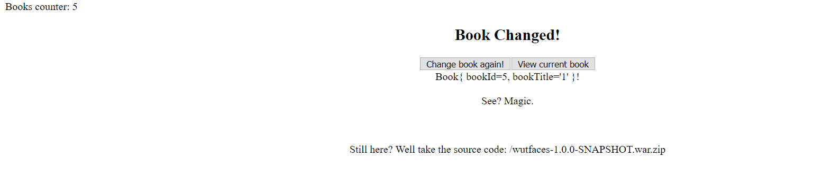
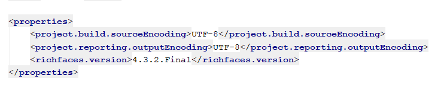
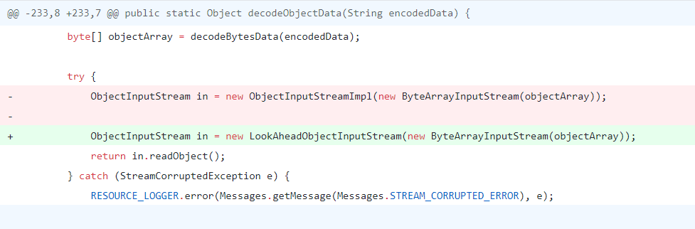
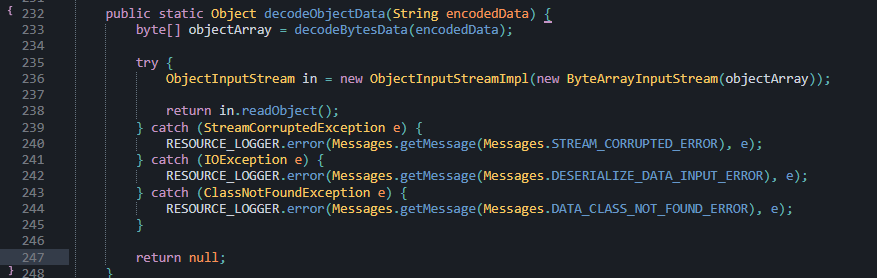
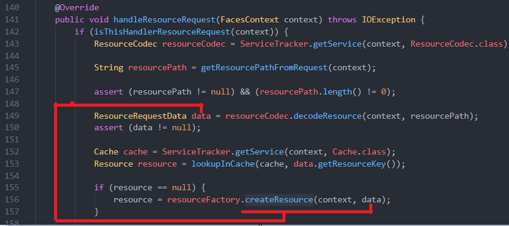
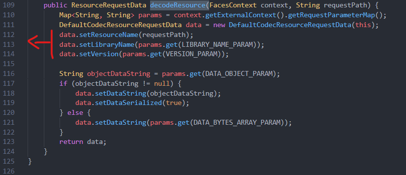
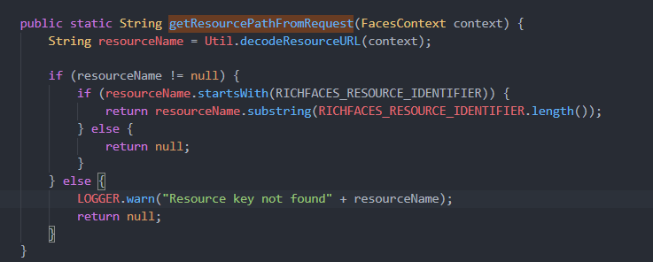

# Java Deserialize 

---

> Source + writeup : https://blog.tint0.com/2019/03/matesctf-2018-wutfaces-cve-2013-2165.html ❤

## Analysis

- **Get Source** 

> pom.xml

- Version richfaces : **4.3.2 final**

- Dựa vào writeup mình tìm thấy bản [diff](https://github.com/richfaces4/core/compare/4.3.2.20130513-Final...4.3.3.20130710-Final)  và `CVE-2013-2165`

- `ObjectInputStreamImpl` đã đươc chuyển thành `LookAheadObjectInputStream` để fix deserialize 
- Toàn bộ code lỗi

=> RCE dựa vào `in.readObject()` . Tiếp theo phải trace được thằng nào dùng hàm lỗi này.

- Trace ngược lại để tìm endpoint:

  1. impl\src\main\java\org\richfaces\util\Util.java : **decodeObjectData()**
  
  2. impl\src\main\java\org\richfaces\resource\DefaultCodecResourceRequestData.java : **getData()**
  
3. impl\src\main\java\org\richfaces\resource\ResourceFactoryImpl.java : **createResource()**
  
  4. impl\src\main\java\org\richfaces\resource\ResourceHandlerImpl.java **-> handleResourceRequest()** : từ đây trace tiếp tới `resourceCodec.decodeResource` để xem data đã được tạo thế nào

  5. impl\src\main\java\org\richfaces\resource\DefaultResourceCodec.java : **decodeResource()** 

- Param nhận vào là
       -  `requestPath` ~ `resourcePath`
       -  `LIBRARY_NAME_PARAM` ~ `ln`
       -  `VERSION_PARAM` ~ `v`
     	  -  Ngoài ra : Nếu `DATA_OBJECT_PARAM` ~ `do` != null => nhận . còn không thì sẽ lấy `DATA_BYTES_ARRAY_PARAM` ~ `db`
          => Xong flow , giờ chỉ tìm cách ghép lại thành 1 url hoàn chỉnh để inject  . Để vào được endpoint  ta phân tích lúc `getResouce`
  
    > impl\src\main\java\org\richfaces\resource\ResourceHandlerImpl.getResourcePathFromRequest()
  
    
   
    - `resourceName` phải bắt đầu bằng `RICHFACES_RESOURCE_IDENTIFIER` ~ `/rfRes/` và có tồn tại 
    - kèm theo các param: ?v=...&?do=`FUKOBJECT`&ln=... (hoặc do thay bằng db
  - URL hoàn chỉnh
    - http://localhost:8080/ctf_wutfaces_resources/rfRes/buttonHoverBackgroundImage.png.jsf?v=4.3.2.Final&do=....&ln=org.richfaces.images

## Build gadget chain 

| *   Wutfaces gadget chain: |                                                             |
| -------------------------- | ----------------------------------------------------------- |
|                            | *                                                           |
|                            | *   ObjectInputStream.readObject()                          |
|                            | *      java.util.HashMap.readObject()                       |
|                            | *          java.util.HashMap.putVal()                       |
|                            | *              java.util.HashMap.hash()                     |
|                            | *                  com.tint0.wutfaces.BookHolder.hashCode() |

---

## Using EL solve it ! (after)