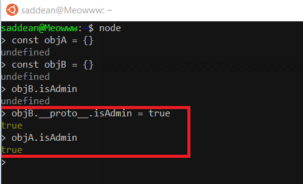
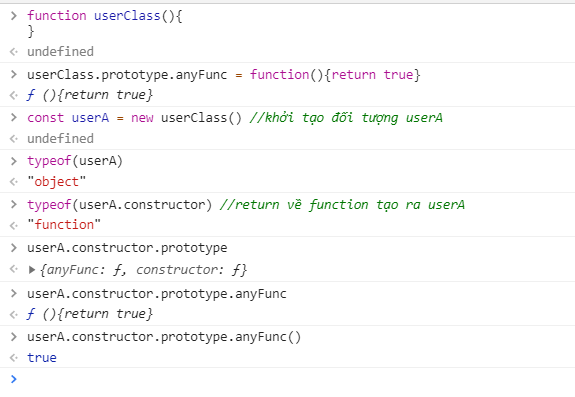
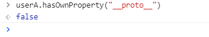
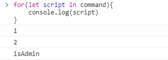

# Prototype pollution

---

# Explain vuln



- Javascript hoạt động theo dạng đối tượng, mỗi đối tượng tạo ra sẽ kế thừa từ các đối tượng cha. Khi bạn tạo ra đối tượng  nó sẽ kế thừa class `Object` , hay string sẽ kế thừa lớp `String`
- Đọc thêm về js:
  - [OOP](https://toidicodedao.com/2016/02/23/series-javascript-sida-oop-trong-javascript/)
  - [Prototype](https://toidicodedao.com/2016/02/02/series-javascript-sida-po-ro-to-tai-prototype-la-cai-gi/)
  - [Object JS](https://toidicodedao.com/2016/01/19/series-javascript-sida-object-trong-javascript/)

## Magic property: 

  ### `Contructor` 

  - Khi gọi đến constructor nó sẽ trả về function được sử dụng để tạo nên Object. Và đặc biệt `contructor` có property là `prototype`

    

### ``__proto__``

- Khi gọi đến sẽ return về prototype của class của đối tượng đó, đây không phải chuẩn của JS, nó chỉ thực sự hỗ trợ ở môi trường nodeJS. Điều này đặc biệt `__proto__` không được định nghĩa là một property của Object. 

  

  ## Phân tích rõ

  - Sample: `obj[a][b] = value` : kẻ tấn công có thể control được giá trị `a` và `value`. Điều này khi dẫn đến khi `a = __proto__`  và `value` tuỳ thích . Thì mọi object được khởi tạo bởi  class `obj` đều sẽ bị ảnh hưởng.

  ### Phân tích điều kiện:

  **Object recursive merge:**

  ```javascript
  var merge = function(target, source) {
      for(var attr in source) {
          if(typeof(target[attr]) === "object" && typeof(source[attr]) === "object") {
              merge(target[attr], source[attr]);
          } else {
              target[attr] = source[attr];
          }
      }
      return target;
  };
  
  var rawObject = {"a":1,"b":2}
  
  var pollutionObject = JSON.parse('{"__proto__":{"isAdmin":1}}');
  
  var mergeObject = merge(rawObject,pollutionObject)
  
  var emptyObject = {}
  
  console.log(emptyObject.isAdmin)
  // 1 => isAdmin true 
  
  // Debug
  // Khi duyệt vòng lặp tới thuộc tính __proto__ :
  // merge(target[__proto__],source[__proto__])
  // => target[__proto__] = {isAdmin:1} => Object poluted !!!
  ```

# Attack with vuln

1. DDOS : `'{"__proto__":{"toString":"dDos","valueOf":"dDos"}}'`

2. For - loop pollution : for in loop tất cả key cả trong prototype

   

3. Property injection : có thể injection các đối tượgn quan trọgn để leo quyền , RCE 


---

# Some case realworld

